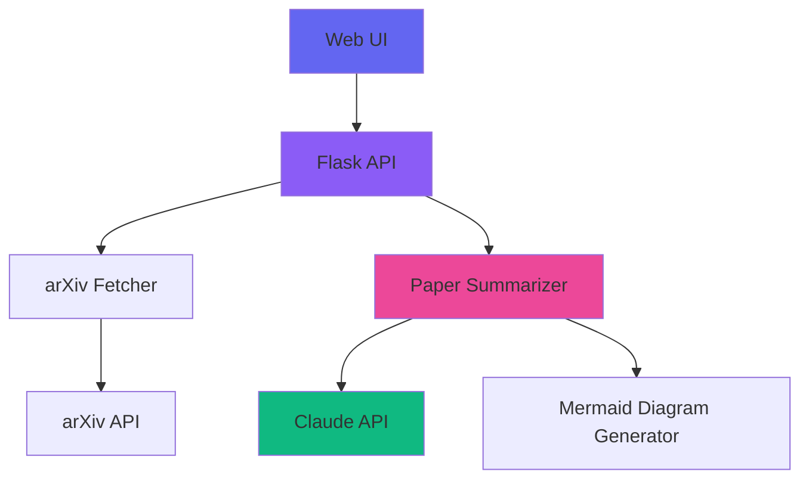

# 🤖 AI論文要約エージェント / AI Paper Summarizer Agent

最新の生成AI論文を自動的に調査・要約・図解する知的エージェントシステム

An intelligent agent system that automatically researches, summarizes, and visualizes the latest generative AI papers.


## 🌟 特徴 / Features

### 日本語
- 📚 **arXiv統合**: arXiv APIから最新のAI論文を自動取得
- 🤖 **AI要約**: Claude AIを使用した高品質な論文要約
- 📊 **自動図解**: Mermaidを使用した論文のアーキテクチャ図の自動生成
- 🔍 **高度な検索**: キーワード、カテゴリ、日付による柔軟な検索
- 🎨 **モダンなUI**: レスポンシブでダークテーマのWebインターフェース
- 🚀 **REST API**: 簡単に統合できるRESTful API
- 🌐 **多言語対応**: 日本語での分かりやすい解説

### English
- 📚 **arXiv Integration**: Automatically fetches latest AI papers from arXiv API
- 🤖 **AI Summarization**: High-quality paper summaries using Claude AI
- 📊 **Auto-Diagramming**: Automatic architecture diagram generation using Mermaid
- 🔍 **Advanced Search**: Flexible search by keywords, categories, and dates
- 🎨 **Modern UI**: Responsive web interface with dark theme
- 🚀 **REST API**: Easy-to-integrate RESTful API
- 🌐 **Multilingual**: Clear explanations in Japanese

## 🏗️ アーキテクチャ / Architecture



## 📋 前提条件 / Prerequisites

- Python 3.8以上 / Python 3.8+
- Anthropic API Key (Claude AI)
- インターネット接続 / Internet connection

## 🚀 セットアップ / Setup

### 1. リポジトリのクローン / Clone the repository

```bash
git clone <your-repo-url>
cd reseacher
```

### 2. 依存関係のインストール / Install dependencies

```bash
pip install -r requirements.txt
```

### 3. 環境変数の設定 / Configure environment variables

`.env`ファイルを作成して、Anthropic API Keyを設定します:

Create a `.env` file and set your Anthropic API Key:

```bash
cp .env.example .env
# Edit .env and add your API key
```

`.env`の内容 / Contents of `.env`:
```
ANTHROPIC_API_KEY=your_actual_api_key_here
```

### 4. アプリケーションの起動 / Start the application

```bash
python app.py
```

アプリケーションは `http://localhost:5000` で起動します。

The application will start at `http://localhost:5000`.

## 📖 使い方 / Usage

### Webインターフェース / Web Interface

1. ブラウザで `http://localhost:5000` を開く
2. 検索ボックスにキーワードを入力（例: "diffusion model", "GPT", "transformer"）
3. 「検索」ボタンをクリック、または「最新論文」ボタンで最新の論文を取得
4. 各論文カードの「要約する」ボタンをクリックして詳細な要約と図を表示

### API エンドポイント / API Endpoints

#### 論文検索 / Search Papers
```bash
GET /api/search?query=generative%20AI&max_results=10
```

#### 最新論文の取得 / Get Latest Papers
```bash
GET /api/latest?max_results=10
```

#### カテゴリ別検索 / Search by Category
```bash
GET /api/category/cs.AI?max_results=10
```

利用可能なカテゴリ / Available categories:
- `cs.AI` - Artificial Intelligence
- `cs.LG` - Machine Learning
- `cs.CV` - Computer Vision
- `cs.CL` - Computation and Language (NLP)

#### 論文の要約 / Summarize a Paper
```bash
POST /api/summarize
Content-Type: application/json

{
  "paper": {
    "title": "Paper Title",
    "authors": ["Author 1", "Author 2"],
    "summary": "Abstract text...",
    "published": "2024-01-01",
    "pdf_url": "https://arxiv.org/pdf/..."
  }
}
```

#### 複数論文の要約 / Summarize Multiple Papers
```bash
POST /api/summarize-multiple
Content-Type: application/json

{
  "papers": [
    { "title": "...", "summary": "..." },
    { "title": "...", "summary": "..." }
  ]
}
```

#### 論文の比較分析 / Compare Papers
```bash
POST /api/compare
Content-Type: application/json

{
  "papers": [
    { "title": "...", "summary": "..." },
    { "title": "...", "summary": "..." }
  ]
}
```

## 🧪 テスト / Testing

個別モジュールのテスト:

Test individual modules:

```bash
# arXiv Fetcherのテスト
python arxiv_fetcher.py

# Paper Summarizerのテスト
python paper_summarizer.py
```

## 📁 プロジェクト構造 / Project Structure

```
reseacher/
├── app.py                  # Flask application
├── arxiv_fetcher.py        # arXiv API integration
├── paper_summarizer.py     # AI summarization agent
├── requirements.txt        # Python dependencies
├── .env.example           # Environment variables template
├── .gitignore            # Git ignore file
├── README.md             # This file
├── templates/
│   └── index.html        # Main web page
└── static/
    ├── css/
    │   └── style.css     # Styles
    └── js/
        └── app.js        # Frontend JavaScript
```

## 🔧 設定 / Configuration

### 環境変数 / Environment Variables

| 変数名 / Variable | 説明 / Description | デフォルト / Default |
|-------------------|-------------------|---------------------|
| `ANTHROPIC_API_KEY` | Claude API key | (required) |
| `PORT` | Server port | 5000 |
| `DEBUG` | Debug mode | False |

### カスタマイズ / Customization

- **検索クエリ**: `arxiv_fetcher.py`で検索クエリをカスタマイズ
- **要約プロンプト**: `paper_summarizer.py`でプロンプトを調整
- **UIテーマ**: `static/css/style.css`でカラーテーマを変更

## 🎨 UIスクリーンショット / UI Screenshots

### メイン画面 / Main Screen
- 🔍 検索バー with キーワード入力
- 🏷️ カテゴリクイックボタン (AI, ML, CV, NLP)
- 📋 論文リスト with カード表示

### 要約モーダル / Summary Modal
- 📝 構造化された要約 (概要、主な貢献、技術的アプローチ、重要性)
- 📊 Mermaidダイアグラム (アーキテクチャ図)
- 🔗 PDF リンク

## 🤝 貢献 / Contributing

プルリクエストを歓迎します！

Pull requests are welcome!

1. このリポジトリをフォーク
2. フィーチャーブランチを作成 (`git checkout -b feature/amazing-feature`)
3. 変更をコミット (`git commit -m 'Add amazing feature'`)
4. ブランチにプッシュ (`git push origin feature/amazing-feature`)
5. プルリクエストを作成

## 📝 ライセンス / License

このプロジェクトはMITライセンスの下で公開されています。

This project is licensed under the MIT License.

## 🙏 謝辞 / Acknowledgments

- [arXiv](https://arxiv.org/) - 論文データベース / Paper database
- [Anthropic Claude](https://www.anthropic.com/) - AI要約エンジン / AI summarization engine
- [Mermaid](https://mermaid.js.org/) - ダイアグラム生成 / Diagram generation
- [Flask](https://flask.palletsprojects.com/) - Webフレームワーク / Web framework

## 📞 サポート / Support

問題が発生した場合は、GitHubのIssuesで報告してください。

If you encounter any issues, please report them on GitHub Issues.

---

Made with ❤️ for AI researchers and enthusiasts
